# DEABS v2 — Akış Şemaları

## 1. Üst Seviye Genel Akış

Tüm sürecin kuş bakışı özeti. Toplantıda başlangıç slaytı olarak kullanılabilir.

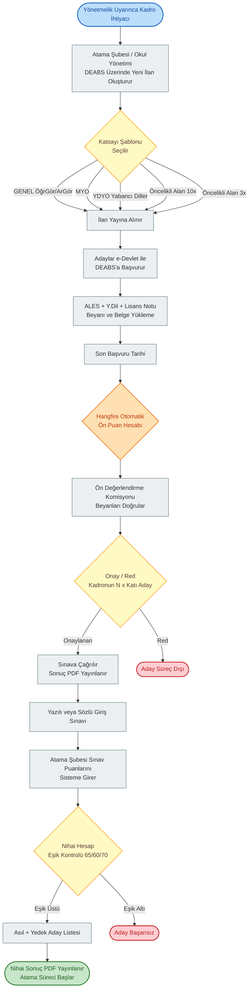

---

## 2. Aday Giriş ve Kayıt Akışı

İlk kez başvuracak aday ile mevcut kullanıcı arasındaki ayrımı gösterir. Mevcut DEABS altyapısı korunur, yeni süreç için ek bir kayıt adımı yoktur.

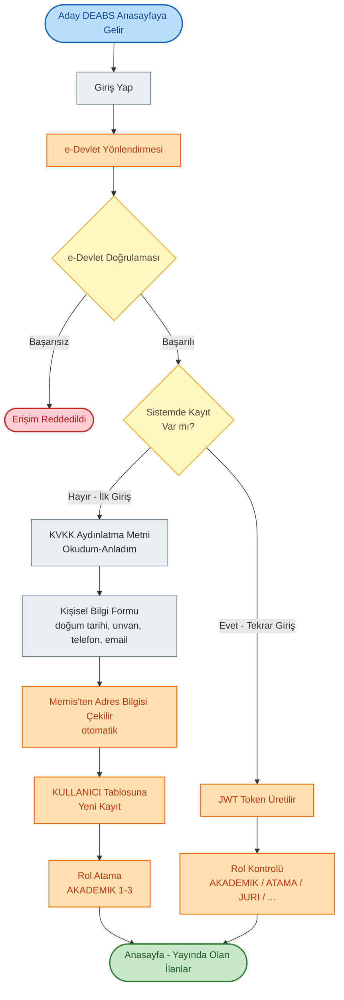

---

## 3. İlan Oluşturma Akışı (Atama Şubesi / Okul Yönetimi)

Mevcut sistemden tek farkı: ÖğrGör/ArGör ilanları Personel Otomasyonu'ndan **aktarılmaz**, doğrudan DEABS üzerinden girilir. Form sihirbaz (MatStepper) yapısındadır.

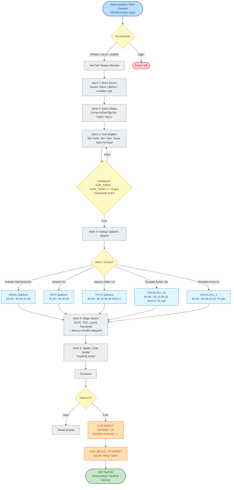

---

## 4. Aday Başvuru Akışı

Aday tarafının detaylı akışı. Mevcut belge yükleme adımına ek olarak **3 yeni puan beyan alanı** + ALES muafiyeti + lisans not sistemi dönüşümü eklenir.

```mermaid
flowchart TD
  classDef baslangic fill:#bbdefb,stroke:#1565c0,stroke-width:2px,color:#0d47a1
  classDef basari    fill:#c8e6c9,stroke:#2e7d32,stroke-width:2px,color:#1b5e20
  classDef sistem    fill:#ffe0b2,stroke:#ef6c00,stroke-width:1.5px,color:#bf360c
  classDef karar     fill:#fff9c4,stroke:#f9a825,stroke-width:1.5px,color:#5d4037
  classDef red       fill:#ffcdd2,stroke:#c62828,stroke-width:2px,color:#b71c1c
  classDef islem     fill:#eceff1,stroke:#546e7a,stroke-width:1px,color:#263238
  classDef uyari     fill:#ffe082,stroke:#ff8f00,stroke-width:1.5px,color:#4e342e

  A([Aday Anasayfada<br/>Yayındaki İlanları Görür]):::baslangic --> B[İlan Detayını İnceler]:::islem
  B --> C{Şartları<br/>Sağlıyor mu?}:::karar
  C -->|Hayır| Z1([Başvurmaz]):::red
  C -->|Evet| D{İlan Türü?}:::karar

  D -->|Öğretim Üyesi mevcut| E1[Klasik Belge Yükleme Formu<br/>Puanlar XXPER'dan otomatik]:::islem
  D -->|ArGör / ÖğrGör YENİ| E2[Genişletilmiş Form<br/>+ Puan Beyan Bölümü]:::islem

  E2 --> F[Belge Yükleme<br/>özgeçmiş, nüfus, askerlik, adli sicil...]:::islem

  F --> G[ALES Puanı Beyanı]:::islem
  G --> G1{ALES Muafiyeti<br/>Talep Ediliyor mu?<br/>Yönetmelik M.14/1}:::karar
  G1 -->|Evet| G2[Muafiyet Gerekçesi Seçilir<br/>Doktora / Uzmanlık / Eski Öğr.Elemanı]:::islem
  G2 --> G3[Muafiyet Belgesi Yükle]:::islem
  G3 --> G4[Sistem ALES = 70 atar]:::sistem
  G1 -->|Hayır| G5[ALES Puanı Sayısal Giriş]:::islem
  G5 --> G6[ALES Sonuç Tarihi]:::islem
  G6 --> G7{ALES 5 Yıl<br/>Geçerli mi?<br/>Yönetmelik M.5}:::karar
  G7 -->|Hayır| G8([Uyarı: ALES Süresi Doldu]):::uyari
  G7 -->|Evet| G9[ALES Belgesi Yükle]:::islem

  G4 --> H[Yabancı Dil Puanı Beyanı]:::islem
  G9 --> H
  H --> H1[Sınav Türü Seç<br/>YDS / YÖKDİL / TOEFL / IELTS]:::islem
  H1 --> H2[Y.Dil Puanı Sayısal Giriş]:::islem
  H2 --> H3{Min Y.Dil<br/>Sağlanıyor mu?<br/>50 veya 85}:::karar
  H3 -->|Hayır| H4([Uyarı: Y.Dil Yetersiz]):::uyari
  H3 -->|Evet| H5[Y.Dil Belgesi Yükle]:::islem

  H5 --> I[Lisans Mezuniyet Notu Beyanı]:::islem
  I --> I1[Not Sistemi Seç<br/>100 / 4 / 5 / Diğer]:::islem
  I1 --> I2[Orijinal Not Girişi]:::islem
  I2 --> I3[Sistem Otomatik 100'lük Karşılık Hesaplar<br/>Yönetmelik M.6/3 YÖK Eşdeğerlik]:::sistem
  I3 --> I4[Lisans Transkripti Yükle]:::islem

  I4 --> J{ArGör İlanı mı?}:::karar
  J -->|Evet| J1{Yaş 35'in<br/>Altında mı?<br/>Yönetmelik M.7/1}:::karar
  J1 -->|Hayır| Z2([Başvuru Engellendi]):::red
  J1 -->|Evet| K[Başvuru Dilekçesi PDF<br/>İndir / İmzala / Yükle]:::islem
  J -->|ÖğrGör| K

  K --> L[Başvuruyu Tamamla]:::islem
  L --> M[BASVURU INSERT<br/>F_BASVURU_DURUM_ID = 1 Taslak]:::sistem
  M --> N[BASVURU_OE_PUAN INSERT<br/>Beyan + belgeler]:::sistem
  N --> O[BASVURU_DETAY INSERT<br/>Belge bağlamları]:::sistem
  O --> P{Aday Onayı<br/>Başvuruyu Kilitle?}:::karar
  P -->|Hayır| Q1[Durum Taslakta Kalır]:::islem
  P -->|Evet| Q2[Durum 2 İncelemede<br/>Versiyon = 1]:::sistem
  Q2 --> R([Başvurularım Sayfası<br/>Dilekçeyi Fiziksel Gönder Uyarısı]):::basari
```

---

## 5. Ön Puan Hesaplama Akışı (Otomatik / Hangfire)

Son başvuru tarihi geçince Hangfire'ın çalıştıracağı arka plan işi. Mevzuat formülünü tam uygular.

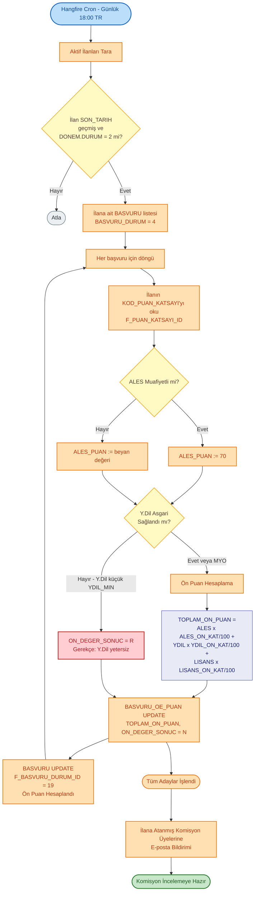

---

## 6. Ön Değerlendirme Komisyonu Akışı

Komisyon hesaplanmış ön puanları belge bazında doğrular, gerekirse manuel düzeltir, sonuç PDF'i üretir.

```mermaid
flowchart TD
  classDef baslangic fill:#bbdefb,stroke:#1565c0,stroke-width:2px,color:#0d47a1
  classDef basari    fill:#c8e6c9,stroke:#2e7d32,stroke-width:2px,color:#1b5e20
  classDef sistem    fill:#ffe0b2,stroke:#ef6c00,stroke-width:1.5px,color:#bf360c
  classDef karar     fill:#fff9c4,stroke:#f9a825,stroke-width:1.5px,color:#5d4037
  classDef red       fill:#ffcdd2,stroke:#c62828,stroke-width:2px,color:#b71c1c
  classDef islem     fill:#eceff1,stroke:#546e7a,stroke-width:1px,color:#263238
  classDef onay      fill:#dcedc8,stroke:#558b2f,stroke-width:1.5px,color:#33691e

  A([Komisyon Üyesi DEABS'a Giriş Yapar]):::baslangic --> B[e-Devlet + Onay Kodu]:::sistem
  B --> C[Kendisine Atanmış İlanların Listesi]:::islem
  C --> D[İlana Tıkla - Aday Listesi Ekranı]:::islem

  D --> E[Adaylar Toplam Ön Puana Göre<br/>Azalan Sırada Listelenir]:::islem
  E --> F[Her Aday için Aksiyon Seçimi]:::islem

  F --> F1{İnceleme Sonucu}:::karar
  F1 -->|Beyanlar Belgeyle Uyumlu| G1[Onayla]:::onay
  F1 -->|Beyan-Belge Tutarsızlığı| G2{Düzeltme veya Red?}:::karar
  F1 -->|Şart Eksik<br/>tecrübe / yaş / lisansüstü| G3[Gerekçeli Reddet]:::red

  G2 -->|Düzeltme| G2A[Puanı Sistemde Düzelt<br/>Açıklama Gir]:::islem
  G2A --> G2B[Ön Puan Yeniden Hesaplanır]:::sistem
  G2B --> G1
  G2 -->|Red| G3

  G3 --> H1[BASVURU_OE_PUAN UPDATE<br/>ON_DEGER_SONUC = R<br/>Gerekçe + Üye + Tarih]:::sistem
  G1 --> H2[Karar Geçici - Daha sonra onaylanır]:::islem

  H1 --> I{Tüm Adaylar<br/>İncelendi mi?}:::karar
  H2 --> I
  I -->|Hayır| F
  I -->|Evet| J[Komisyon Onayı Butonu]:::onay

  J --> K{Sınava Kaç Aday<br/>Çağrılacak?}:::karar
  K --> K1[MAX_ADAY = KADRO_SAYI x ADAY_CARPAN<br/>10 / 4 / 3]:::sistem
  K1 --> K2{Toplam Onaylanan<br/>MAX'tan az mı?}:::karar
  K2 -->|Evet - M.10| K3[Tüm Onaylananları Çağır]:::sistem
  K2 -->|Hayır| K4[İlk MAX_ADAY adayı seç<br/>Son sırada eşit puan varsa<br/>tamamını dahil et M.10]:::sistem

  K3 --> L[BASVURU UPDATE<br/>F_BASVURU_DURUM_ID = 20<br/>Sınava Çağrıldı]:::sistem
  K4 --> L

  L --> M[PDF Üretimi - Mevzuat Formatında]:::sistem
  M --> M1[Birim / Bölüm / Anabilim<br/>Sınav Tarih-Yer-Saat<br/>Sıralı Aday Tablosu - TC Maskeli<br/>Başarılı / Başarısız İşaretleme]:::islem
  M1 --> N[Ön Değerlendirme Sonuç PDF<br/>İndirilip İmzalanır - Yüklenir]:::islem
  N --> O([İlan Sayfasında Yayınlanır<br/>Adaylara E-posta Bildirimi]):::basari
```

---

## 7. Giriş Sınavı ve Sınav Puanı Girişi

Sınav fiziksel ortamda yapılır. Sistemin görevi: jüri puanlarını kayıt altına almak, hibrit (sözlü+yazılı) senaryosunda ortalamayı hesaplamak.

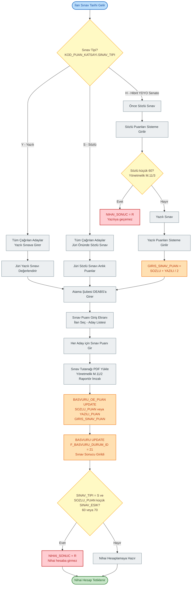

---

## 8. Nihai Sonuç Hesaplama ve Yayın

Sınav puanlarının girilmesi tamamlandığında çalışan akış. Asıl + yedek aday listesi otomatik üretilir.

```mermaid
flowchart TD
  classDef baslangic fill:#bbdefb,stroke:#1565c0,stroke-width:2px,color:#0d47a1
  classDef basari    fill:#c8e6c9,stroke:#2e7d32,stroke-width:2px,color:#1b5e20
  classDef sistem    fill:#ffe0b2,stroke:#ef6c00,stroke-width:1.5px,color:#bf360c
  classDef karar     fill:#fff9c4,stroke:#f9a825,stroke-width:1.5px,color:#5d4037
  classDef red       fill:#ffcdd2,stroke:#c62828,stroke-width:2px,color:#b71c1c
  classDef islem     fill:#eceff1,stroke:#546e7a,stroke-width:1px,color:#263238
  classDef formul    fill:#e8eaf6,stroke:#3949ab,stroke-width:1px,color:#1a237e
  classDef asil      fill:#a5d6a7,stroke:#2e7d32,stroke-width:2px,color:#1b5e20
  classDef yedek     fill:#fff59d,stroke:#fbc02d,stroke-width:1.5px,color:#5d4037

  A([Atama Şubesi Nihai Hesap Tetikler]):::baslangic --> B[İlandaki Sınava Giren Adaylar<br/>F_BASVURU_DURUM_ID = 21]:::sistem
  B --> C[Her Aday için Döngü]:::sistem
  C --> D{Sözlü Eşik Eleme<br/>SOZLU_PUAN küçük SINAV_ESIK?}:::karar
  D -->|Evet| D1[NIHAI_SONUC = R<br/>Nihai hesaba dahil etme]:::red
  D -->|Hayır| E[Nihai Puan Hesabı]:::sistem

  E --> E1[TOPLAM_NIHAI_PUAN =<br/>ALES x ALES_GIRIS_KAT +<br/>YDIL x YDIL_GIRIS_KAT +<br/>LISANS x LISANS_GIRIS_KAT +<br/>SINAV x SINAV_GIRIS_KAT]:::formul
  E1 --> F{Nihai Puan büyük eşit BASARI_ESIK?<br/>65 veya 70}:::karar
  F -->|Hayır| F1[NIHAI_SONUC = R<br/>Başarısız]:::red
  F -->|Evet| F2[Geçici: Başarılı Listesi]:::islem

  D1 --> G{Tüm Adaylar<br/>Hesaplandı mı?}:::karar
  F1 --> G
  F2 --> G

  G -->|Hayır| C
  G -->|Evet| H[Başarılı Adaylar Nihai Puana Göre<br/>Azalan Sıralanır]:::sistem

  H --> I[İlk KADRO_SAYI aday<br/>NIHAI_SONUC = B - Asıl]:::asil
  I --> J[Sonraki KADRO_SAYI aday<br/>NIHAI_SONUC = Y - Yedek<br/>Yönetmelik M.13]:::yedek
  J --> K[Kalanlar NIHAI_SONUC = R<br/>Eşik üstü ama liste dışı]:::red

  K --> L[BASVURU_OE_PUAN UPDATE<br/>NIHAI_SIRA + NIHAI_SONUC]:::sistem
  L --> M{Asıl mı?}:::karar
  M -->|Evet| M1[BASVURU UPDATE<br/>F_BASVURU_DURUM_ID = 22<br/>Nihai Başarılı]:::sistem
  M -->|Hayır - Y/R| M2[BASVURU UPDATE<br/>F_BASVURU_DURUM_ID = 23<br/>Nihai Başarısız veya Yedek]:::sistem

  M1 --> N[Nihai Sonuç PDF Üretimi]:::sistem
  M2 --> N
  N --> N1[Birim Başlığı<br/>Asıl Aday Tablosu - Sırayla<br/>Yedek Aday Tablosu - Sırayla<br/>İmza Alanları]:::islem
  N1 --> O[PDF İndirilir - İmzalanır - Yüklenir]:::islem
  O --> P([Yayınlanır<br/>DEABS Ana Sayfa + Adaylara E-posta]):::basari

  P --> Q[Asıl Adaylar İçin<br/>Atama Süreci Personel Otomasyonu Üzerinden]:::islem
  Q --> R([Süreç Tamamlandı]):::basari
```

---

## 9. Başvuru Durum Makinesi

KOD_BASVURU_DURUM tablosundaki durumların geçiş haritası. Mevcut öğretim üyesi süreciyle paralel ama farklı bir akış izler.

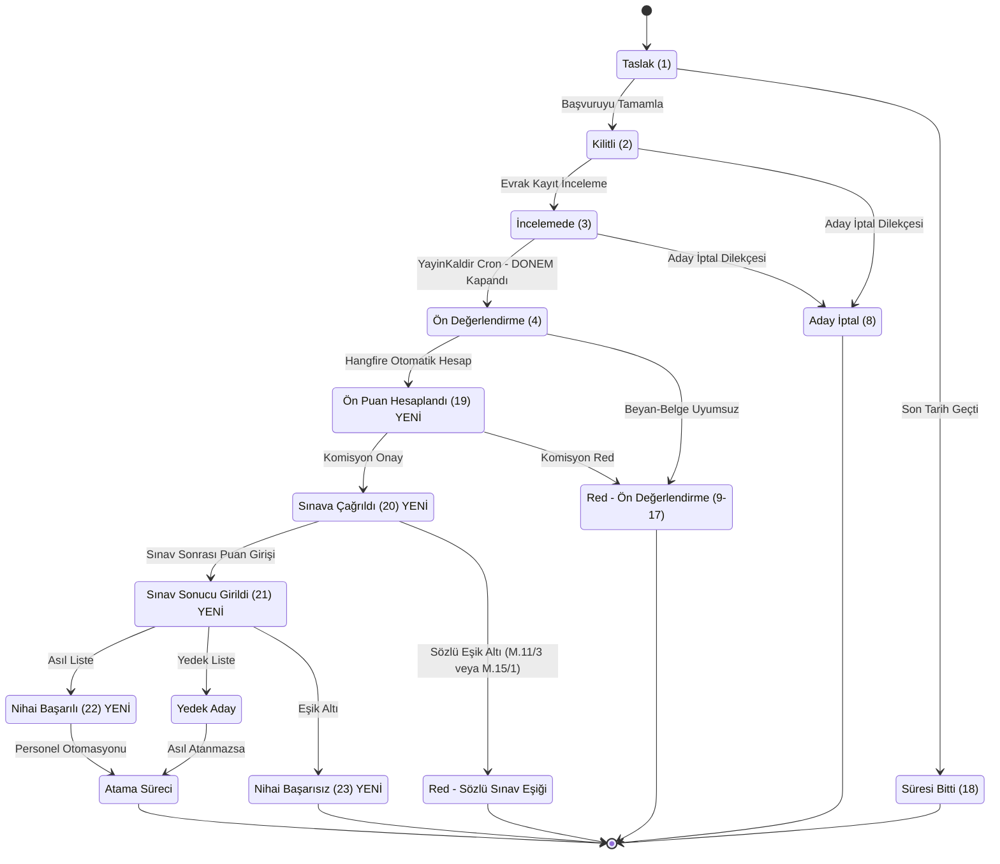

**Not:** Mermaid stateDiagram'da renk kontrolü flowchart'a göre kısıtlı; durumlar arası geçişin görünmesi öncelikli. Yeni eklenen 19-23 durumları "YENİ" etiketi ile işaretlenmiştir.

---

## 10. Roller Arası Sequence Diyagramı

Toplantıda en sık sorulacak "kim ne zaman ne yapar" sorusunun cevabı. Mesajlaşma sırası.

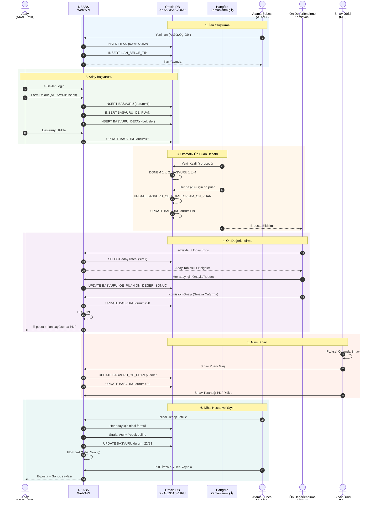

---

## 11. Aday Durum Bildirimleri / İletişim Akışı

Aday tarafının süreç boyunca aldığı bildirimler. Mevcut DEABS e-posta altyapısı yeniden kullanılır.

```mermaid
flowchart LR
  classDef baslangic fill:#bbdefb,stroke:#1565c0,stroke-width:2px,color:#0d47a1
  classDef basari    fill:#c8e6c9,stroke:#2e7d32,stroke-width:2px,color:#1b5e20
  classDef karar     fill:#fff9c4,stroke:#f9a825,stroke-width:1.5px,color:#5d4037
  classDef red       fill:#ffcdd2,stroke:#c62828,stroke-width:2px,color:#b71c1c
  classDef islem     fill:#eceff1,stroke:#546e7a,stroke-width:1px,color:#263238
  classDef bildirim  fill:#e1f5fe,stroke:#0277bd,stroke-width:1px,color:#01579b
  classDef yedek     fill:#fff59d,stroke:#fbc02d,stroke-width:1.5px,color:#5d4037

  A([Aday Başvuru Yaptı]):::baslangic --> N1[E-posta: Başvuru Alındı]:::bildirim
  N1 --> B([Aday Kilitledi]):::islem
  B --> N2[E-posta: Dilekçeyi Fiziksel Gönderin<br/>Periyodik tekrar]:::bildirim
  N2 --> C([Evrak Kayıt Belgenete Aktardı]):::islem
  C --> N3[E-posta: Dilekçe Teslim Alındı<br/>Periyodik uyarı durdurulur]:::bildirim
  N3 --> D([Son Başvuru Tarihi Geçti]):::islem
  D --> N4[E-posta: Değerlendirme Aşamasında]:::bildirim
  N4 --> E([Komisyon Onay / Red]):::islem
  E --> N5{Sonuç?}:::karar
  N5 -->|Onay| N5A[E-posta: Sınava Çağrıldınız<br/>+ Sınav Tarih / Yer / Saat]:::bildirim
  N5 -->|Red| N5B[E-posta: Ön Değerlendirme Sonucu<br/>+ Gerekçe + İtiraz Hakkı]:::red
  N5A --> F([Sınav Yapıldı]):::islem
  F --> G([Nihai Hesap Tamamlandı]):::islem
  G --> N6{Nihai?}:::karar
  N6 -->|Başarılı / Asıl| N6A[E-posta: Atama İşlemleri Başladı]:::basari
  N6 -->|Yedek| N6B[E-posta: Yedek Listede]:::yedek
  N6 -->|Başarısız| N6C[E-posta: Sonuç İlanı PDF Linki]:::red
```

---

## 12. Belirsiz / Toplantıda Karara Bağlanacak Adımlar

Aşağıdaki diyagram, henüz **kesin karara bağlanmamış** akış parçalarını gösterir. Toplantıda her birinin yolu seçilecek.

```mermaid
flowchart TD
  classDef belirsiz  fill:#fff9c4,stroke:#f57f17,stroke-width:2.5px,color:#3e2723
  classDef secenek   fill:#e8eaf6,stroke:#3949ab,stroke-width:1px,color:#1a237e
  classDef onerilen  fill:#c8e6c9,stroke:#2e7d32,stroke-width:1.5px,color:#1b5e20

  Q1{1. Sınav Jürisi Atama<br/>Kim Yapıyor?}:::belirsiz
  Q1 -->|Seçenek A| Q1A[DEABS Üzerinden<br/>Atama Şubesi]:::onerilen
  Q1 -->|Seçenek B| Q1B[Oracle Forms<br/>Personel Otomasyonu]:::secenek
  Q1 -->|Seçenek C| Q1C[Hibrit - Forms'ta atanır<br/>DEABS okur]:::secenek

  Q2{2. Öncelikli Alan Sözlü Sınav<br/>Dış Üniversite Üyesi Erişimi}:::belirsiz
  Q2 -->|Seçenek A| Q2A[Dış Üye e-Devlet<br/>ile Giriş Yapar]:::secenek
  Q2 -->|Seçenek B| Q2B[Onay Kodu + Email<br/>Mevcut Bilim Jürisi Paterni]:::onerilen

  Q3{3. Sınav Puanı Girişi<br/>Kim Yapar?}:::belirsiz
  Q3 -->|Seçenek A| Q3A[Raportör Üye<br/>JURI Rolü]:::secenek
  Q3 -->|Seçenek B| Q3B[Atama Şubesi<br/>ATAMA Rolü]:::onerilen
  Q3 -->|Seçenek C| Q3C[3 Jüri Üyesi Ayrı Ayrı<br/>Sistem Ortalama Alır]:::secenek

  Q4{4. Kapsam Dışı Atamalar<br/>M.2/2 Tıpta Uzmanlık vb.}:::belirsiz
  Q4 -->|Seçenek A| Q4A[DEABS'a Hiç Girmez]:::secenek
  Q4 -->|Seçenek B| Q4B[ILAN.KAPSAM_DISI Bayrağı<br/>Sınav Atlanır]:::onerilen

  Q5{5. Yedek Adayların<br/>Atamasız Kalması}:::belirsiz
  Q5 -->|Senaryo 1| Q5A[Asıl Atanmazsa<br/>Yedek Otomatik Asıl Olur]:::secenek
  Q5 -->|Senaryo 2| Q5B[Yedek Sadece Liste<br/>Atama Manuel]:::onerilen

  Q6{6. MADDE 15/3 - 6/3/2026<br/>Öncelikli Alan Doktora Öğrencisi}:::belirsiz
  Q6 -->|DEÜ Kapsamında| Q6A[Yeni Akış Kurgulanır<br/>YÖK Merkezi Yazılı + Sistem Sıralaması]:::secenek
  Q6 -->|Kapsam Dışı| Q6B[Şimdilik Skip]:::onerilen
```

**Lejant:**
- **Sarı kutular:** Toplantıda karara bağlanacak ana sorular
- **Yeşil kutular:** Yazılım ekibinin tavsiye ettiği seçenek
- **Açık mavi kutular:** Alternatifler

---

## Toplantı Sunum Önerisi

Toplantıyı bu sırayla götürmek mantıklı olur:

1. **Diyagram 1 (Üst Seviye)** — "Genel resim böyle. 3 dk anlatım."
2. **Diyagram 2 (Aday Giriş)** — "Aday tarafı mevcut sistemle aynı, ek yük yok."
3. **Diyagram 3 (İlan Oluşturma)** — "Burası tamamen yeni — sizin için fark yok mu? Onay/değişiklik istekleri var mı?"
4. **Diyagram 4 (Aday Başvuru)** — "Aday formuna 3 yeni alan ekleniyor — beyan/muafiyet/lisans dönüşüm. Bunlardan hangileri zorunlu/opsiyonel?"
5. **Diyagram 5 (Ön Puan Hesabı)** — "Sistem bunu otomatik yapacak. Komisyon ham veri yerine sıralı liste görecek."
6. **Diyagram 6 (Komisyon)** — "Komisyon ne yapar, ne yapamaz? Düzeltme yetkisi var mı?"
7. **Diyagram 7 (Sınav)** — "Sınav puanı kim sisteme girer? Tutanak nasıl saklanır?"
8. **Diyagram 8 (Nihai)** — "Yedek aday otomatik mi belirlenir? Asıl atanmazsa ne olur?"
9. **Diyagram 9 (Durum Makinesi)** — "Toplam 23 durum. Yeni eklenen 19-23 sizin için anlaşılır mı?"
10. **Diyagram 10 (Sequence)** — "Akışta zaman sırası" — özellikle BT ile birlikte konuşulacaksa.
11. **Diyagram 11 (Bildirimler)** — "Aday'a ne zaman e-posta gider?"
12. **Diyagram 12 (Belirsizler)** — "Bunları toplantıda kapatalım."

---

## Dosya Versiyonu

| Versiyon | Tarih | Değişiklik |
|---|---|---|
| 1.0 | 2026-05-14 | İlk taslak — toplantı hazırlığı için 12 akış şeması |
| 1.1 | 2026-05-14 | Stil iyileştirmesi: tüm diyagramlarda classDef tabanlı, kontrastlı renk paleti; açık zemin + koyu yazı; sequence diyagramında bölüm vurguları (rect) |
